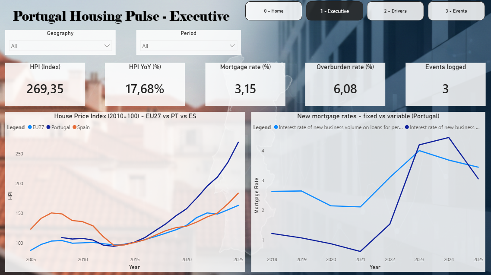
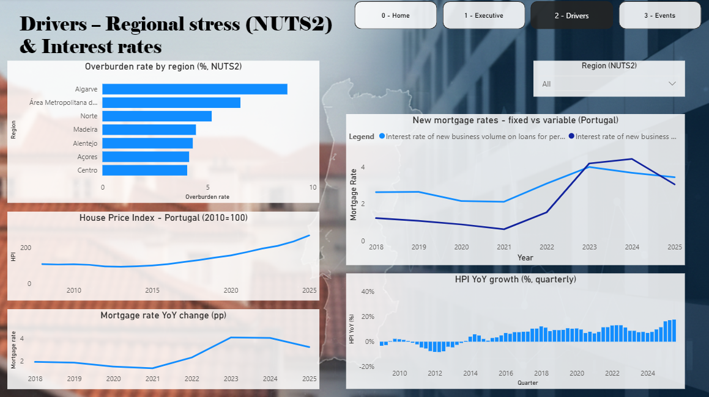
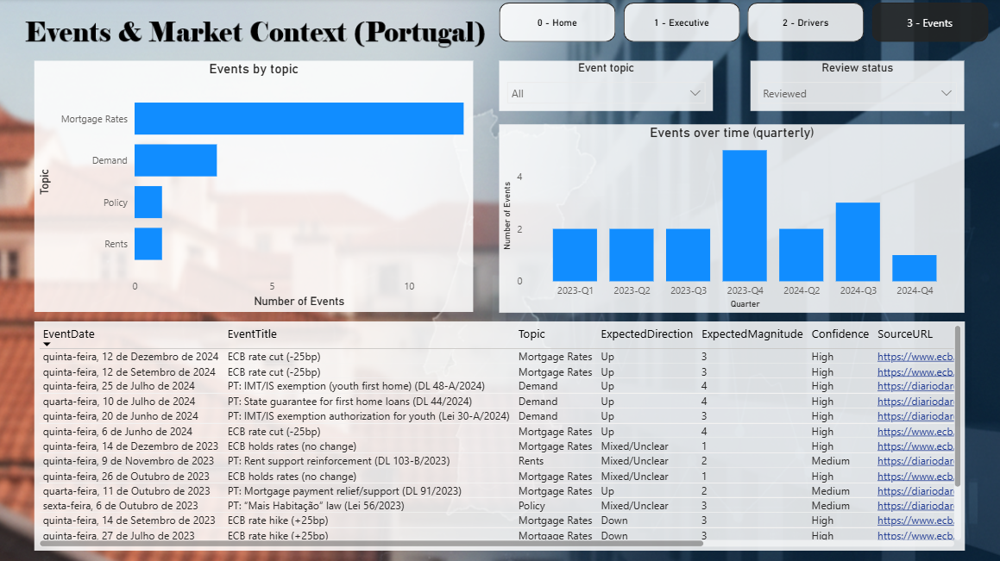
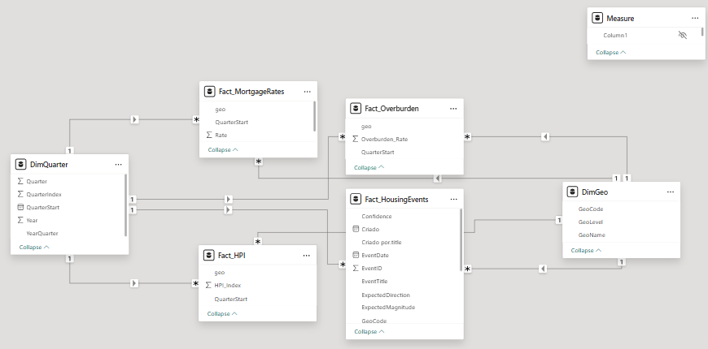
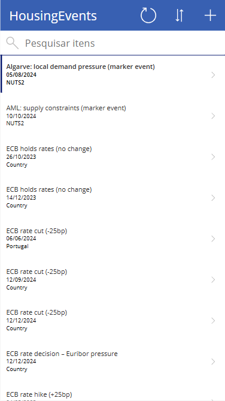
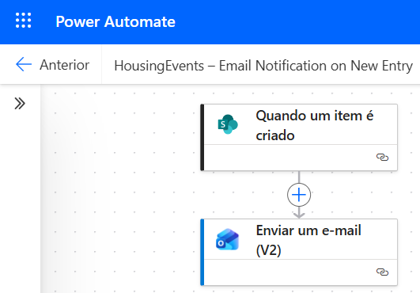
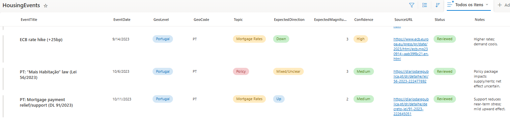

# Portugal Housing Pulse (Power BI + Power Platform)

End-to-end BI project tracking housing affordability and mortgage stress in Portugal, combining macro indicators with a curated event log built on the Power Platform.

---

## Key insights (what this report helps answer)
- **Affordability stress is not uniform**: regional overburden rates (NUTS2) highlight where housing costs are most problematic.
- **Rates matter**: mortgage rate shifts provide context for changes in price momentum (YoY dynamics).
- **Events add explainability**: a curated event log (policy, demand, rate decisions) helps interpret inflection points.

---

## What this project demonstrates
- **Power BI (Desktop)**: Power Query transformations, star schema modeling, DAX KPIs (latest values, YoY growth, trends)
- **Power BI Service**: report/dataset publishing and refresh configuration
- **Power Platform**: SharePoint event log with a **Power App** for data entry and a **Power Automate** email notification flow

---

## Data sources
- **Eurostat** — House Price Index (HPI)
- **Banco de Portugal (bpstat)** — Mortgage interest rates
- **Eurostat** — Housing cost overburden rate (regional/NUTS2)
- **SharePoint list** — `HousingEvents` (curated events + links + confidence + status)

---

## Report pages

### 0 — Home
Landing page with navigation.

### 1 — Executive
Snapshot KPIs and trends:
- HPI (index) and HPI YoY (%)
- Mortgage rate (%)
- Overburden rate (%)
- Logged events counter
- HPI comparison (EU27 vs Portugal vs Spain) and mortgage rates (fixed vs variable)

### 2 — Drivers (NUTS2)
Regional stress + rate-driven dynamics:
- Overburden rate by region (NUTS2)
- HPI trend (Portugal)
- Mortgage rate levels and YoY change
- Quarterly HPI YoY growth

### 3 — Events & Market Context
Curated event log + distribution:
- Events by topic
- Events over time (YearQuarter)
- Detailed table (date, topic, direction, magnitude, confidence, source link)

---

## Data model (star schema)
Dimensions:
- `DimQuarter` (time)
- `DimGeo` (geography)

Facts:
- `Fact_HPI`
- `Fact_MortgageRates`
- `Fact_Overburden`
- `Fact_HousingEvents` (SharePoint)

---

## Power Platform
SharePoint list schema: `docs/sharepoint-schema.md`  
Power Platform overview: `docs/power-platform.md`

**Power Apps**

**Power Automate**

**SharePoint**

---

## Template
A `.pbit` Power BI template is available in `powerbi/` (data source credentials required).

---

## Repository structure
- `powerbi/` — Power BI template (`.pbit`)
- `docs/screenshots/` — report screenshots
- `docs/architecture/` — model diagram
- `docs/power-platform/` — Power Apps / Automate / SharePoint screenshots
- `docs/` — setup notes (SharePoint schema, Power Platform overview)

---

## Author
Tiago dos Santos Lameirão
